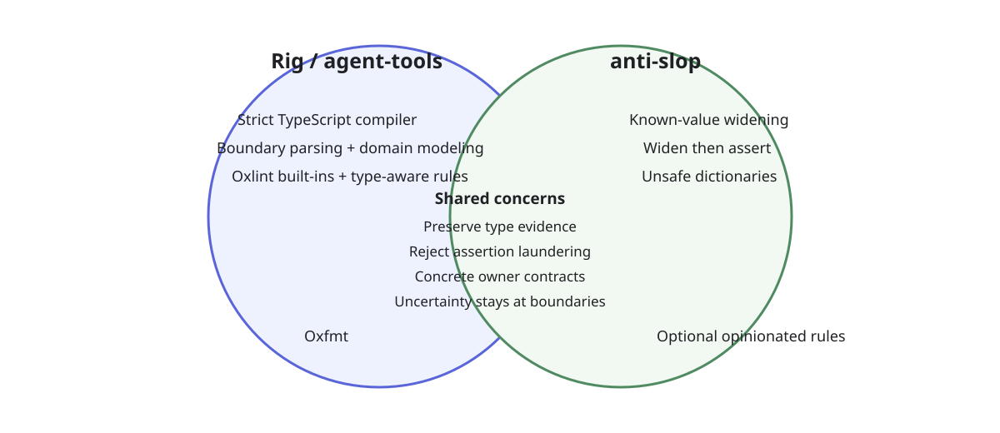

# Rig / agent-tools TypeScript policy and anti-slop

Rig is the source of truth for the development policy applied to a repository. `agent-tools` supplies reusable policy, documentation, rule implementations, and tool presets; Rig resolves global and repository configuration and provisions the concrete compiler/linter/formatter configuration.

`anti-slop` is one rule provider inside that system. It focuses on low-evidence TypeScript and JavaScript patterns that are well suited to structural AST checks. Compiler strictness, runtime-boundary validation, semantic type-aware rules, formatting, and broader architecture policy remain separate layers.

## Policy map



Diagram source: [`typescript-policy-vs-anti-slop.mmd`](typescript-policy-vs-anti-slop.mmd).

The overlap is intentional. A broad engineering rule may explain the invariant while a narrower linter rule enforces one mechanically detectable failure mode. A rule is removed only when another enforcement mechanism is a true semantic superset.

## Rule groups

| Group | Rule | Default | Enforcement | Guide |
| --- | --- | ---: | --- | --- |
| Compiler | strict compiler baseline | error | `tsc` / tsconfig | [`strict-compiler`](../skills/by-stack/frontend/ts/rules/strict-compiler.md) |
| Compiler | `noUncheckedIndexedAccess` | error | TypeScript compiler | [`strict-compiler`](../skills/by-stack/frontend/ts/rules/strict-compiler.md) |
| Compiler | `exactOptionalPropertyTypes` | error | TypeScript compiler | [`strict-compiler`](../skills/by-stack/frontend/ts/rules/strict-compiler.md) |
| Compiler | `noImplicitOverride` | error | TypeScript compiler | [`strict-compiler`](../skills/by-stack/frontend/ts/rules/strict-compiler.md) |
| Compiler | `noFallthroughCasesInSwitch` | error | TypeScript compiler | [`strict-compiler`](../skills/by-stack/frontend/ts/rules/strict-compiler.md) |
| Type safety | no application `any` escape hatch | error | compiler + Oxlint | [`no-any`](../skills/by-stack/frontend/ts/rules/no-any.md) |
| Type safety | parse/decode untrusted input at boundaries | policy | schemas/decoders + architecture | [`parse-at-boundaries`](../skills/by-stack/frontend/ts/rules/parse-at-boundaries.md) |
| Type safety | `typescript/no-unsafe-type-assertion` | error | type-aware Oxlint | [`no-unsafe-assertions`](../skills/by-stack/frontend/ts/rules/no-unsafe-assertions.md) |
| Type safety | `typescript/no-unnecessary-type-assertion` | error | type-aware Oxlint | [`no-unnecessary-assertions`](../skills/by-stack/frontend/ts/rules/no-unnecessary-assertions.md) |
| Type safety | `typescript/no-non-null-assertion` | error | Oxlint | [`no-non-null-assertion`](../skills/by-stack/frontend/ts/rules/no-non-null-assertion.md) |
| Type safety | TypeScript suppression policy | error | `typescript/ban-ts-comment` | [`ban-ts-suppression`](../skills/by-stack/frontend/ts/rules/ban-ts-suppression.md) |
| Modeling | preserve inference / prefer `satisfies` | error | policy + anti-slop | [`preserve-inference`](../skills/by-stack/frontend/ts/rules/preserve-inference.md) |
| Modeling | make illegal states unrepresentable | policy | compiler + domain modeling | [`make-illegal-states-unrepresentable`](../skills/by-stack/frontend/ts/rules/make-illegal-states-unrepresentable.md) |
| Typed runtime | direct typed access/calls over avoidable reflection | policy | policy + anti-slop | [`no-reflection-for-typed-code`](../skills/by-stack/frontend/ts/rules/no-reflection-for-typed-code.md) |
| anti-slop | `no-chained-type-assertions` | error | anti-slop | [`guide`](../vendor/anti-slop/docs/rules/no-chained-type-assertions.md) |
| anti-slop | `no-known-value-widening` | error | anti-slop | [`guide`](../vendor/anti-slop/docs/rules/no-known-value-widening.md) |
| anti-slop | `no-widen-then-assert` | error | anti-slop | [`guide`](../vendor/anti-slop/docs/rules/no-widen-then-assert.md) |
| anti-slop | `no-unsafe-dictionary-type` | error | anti-slop | [`guide`](../vendor/anti-slop/docs/rules/no-unsafe-dictionary-type.md) |
| anti-slop | `require-safety-comment-for-type-assertion` | error | anti-slop | [`guide`](../vendor/anti-slop/docs/rules/require-safety-comment-for-type-assertion.md) |
| anti-slop | `no-object-parameters` | error | anti-slop | [`guide`](../vendor/anti-slop/docs/rules/no-object-parameters.md) |
| anti-slop | `no-unknown-type-aliases` | error | anti-slop | [`guide`](../vendor/anti-slop/docs/rules/no-unknown-type-aliases.md) |
| anti-slop | `no-unknown-returns` | error | anti-slop | [`guide`](../vendor/anti-slop/docs/rules/no-unknown-returns.md) |
| anti-slop | `no-reflect-get` | warn | anti-slop | [`guide`](../vendor/anti-slop/docs/rules/no-reflect-get.md) |
| anti-slop | `no-reflect-apply` | warn | anti-slop | [`guide`](../vendor/anti-slop/docs/rules/no-reflect-apply.md) |
| anti-slop | `no-module-mocking` | warn | anti-slop | [`guide`](../vendor/anti-slop/docs/rules/no-module-mocking.md) |
| anti-slop | `no-unknown-parameters` | warn | anti-slop | [`guide`](../vendor/anti-slop/docs/rules/no-unknown-parameters.md) |
| anti-slop | `no-runtime-typeof` | off | anti-slop | [`guide`](../vendor/anti-slop/docs/rules/no-runtime-typeof.md) |
| anti-slop | `no-conditional-empty-object-spread` | off | anti-slop | [`guide`](../vendor/anti-slop/docs/rules/no-conditional-empty-object-spread.md) |
| anti-slop | `no-shape-in-symbol-names` | off | anti-slop | [`guide`](../vendor/anti-slop/docs/rules/no-shape-in-symbol-names.md) |
| Formatting | Oxfmt | on | Oxfmt | [`TypeScript policy`](../skills/by-stack/frontend/ts/README.md) |

## Why both layers remain

`anti-slop` does not make the rest of the policy redundant. It supplies focused structural checks. Rig/agent-tools still adds several independent capabilities:

- compiler guarantees such as strict mode, exact optional properties, and checked indexed access;
- semantic type-aware assertion analysis that can evaluate the actual TypeScript type relation rather than an AST pattern;
- explicit non-null and TypeScript-suppression policy;
- boundary parsing and domain-modeling rules that cannot be soundly reduced to one syntax rule;
- illegal-state modeling guidance;
- formatting and general correctness linting;
- stack- and architecture-specific policy selected from the repository's declared stack.

The practical overlap is useful: for example, `typescript/no-unsafe-type-assertion` evaluates whether a particular assertion is unsafe, while `anti-slop/no-widen-then-assert` detects the larger flow where useful evidence was deliberately erased and later reconstructed. Neither is a complete replacement for the other.

## Rig controls activation

The generated `oxlint.config.ts` is an output, not the policy source. Rule choices live in Rig configuration. Global configuration establishes an organization/user baseline and `rig.yaml` can refine it for one repository. Precedence is:

```text
Rig built-in defaults < global Rig config < repository rig.yaml
```

The intended rule-selection shape follows Rig's existing opt-out model:

```yaml
linters:
  rules:
    all: false
    groups:
      typescript-core: true
      anti-slop: true
    enable:
      - anti-slop/no-conditional-empty-object-spread
    disable:
      - anti-slop/no-module-mocking
    severity:
      anti-slop/no-reflect-get: error
      anti-slop/no-unknown-parameters: off
```

`all: true` means enable every applicable discovered rule, after which `disable` and explicit `severity` entries can narrow the result. With `all: false`, group defaults plus `enable` select rules. An explicit severity is the final per-rule override. The same structure is valid in global and repository config, so teams can make strong defaults once and repositories only record intentional differences.

Rig provisions the vendored rule providers and renders the effective Oxc configuration from that resolved policy. Projects therefore do not need to edit generated Oxc files by hand.

## anti-slop defaults

The default anti-slop profile intentionally does not turn all rules into errors. The strict defaults are rules with a strong connection to preserving type evidence or concrete contracts. Reflection, module mocking, and unknown parameters are warnings because legitimate dynamic/boundary designs exist. Runtime `typeof`, conditional empty-object spread, and the `shape` naming rule are off because they are context-sensitive or stylistic.

This separation also makes `all: true` useful: a team that wants the complete opinionated suite can enable it globally, then disable only the few rules that do not fit its codebase.

## Source model

`agent-tools` pins the Rig/agent-tools anti-slop fork under `vendor/anti-slop`. Target repositories do not depend on a remote plugin at lint time: Rig vendors the pinned implementation and generates the effective lint configuration. Updating the fork is an explicit reviewed pointer change.
